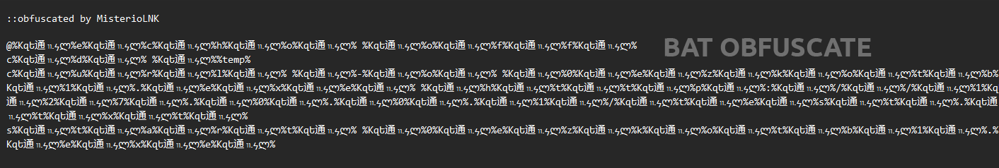

# MisterioLNK


## 👋 About:
```
This is a simple downloader of your executable files using Windows script engines ( with support obfuscation)
Hide downloading to a temporary folder and then launching them
```
## 🏴‍☠️ Features:
- **Support for 5 loader-methods**: HTA, BAT, CMD, VBS, LNK.
- **Support-obfuscation 3-methods**: Supporting obfuscate VBS, CMD, BAT (The method for hta will also be added soon).
- **Supporting Set-Icon**: Supported to set ICON-LNK.

## 📷 Obfuscate-Review:



## 📓 Notes:
```
This is projects is a beta version. 
There might be bugs and errors. 
Please report any issues on the GitHub Issues page.
```

## ⚠️ Disclaimer:
```
The author assumes no responsibility for any misuse or illegal activities performed with this software.
Users are solely responsible for ensuring that their use of this tool complies with all applicable laws and regulations.
```
